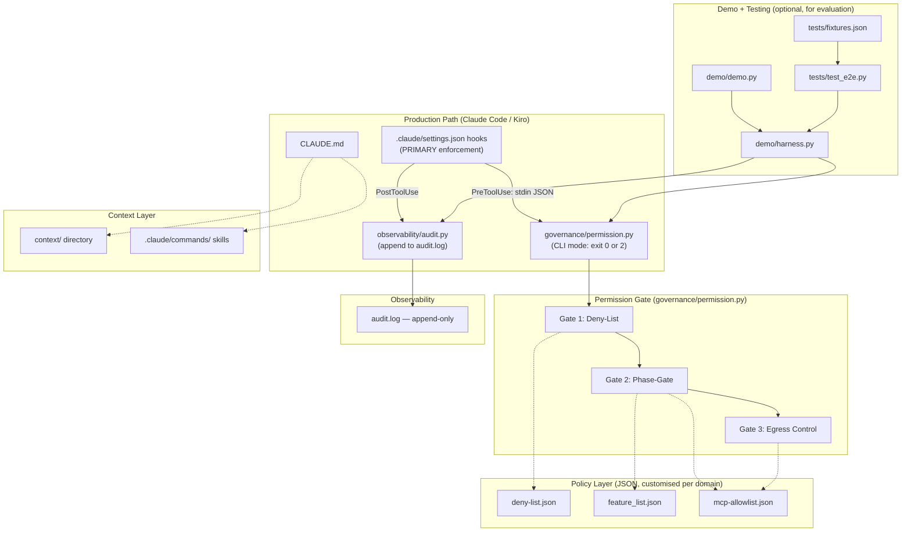
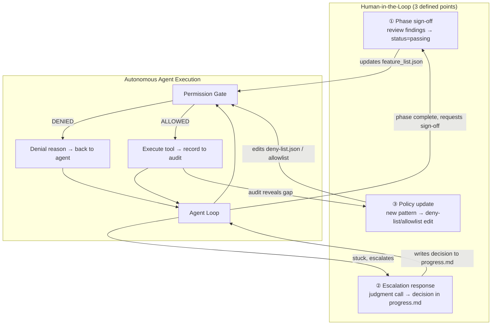

# Design Document: Harness Engineering Platform

## Overview

The Harness Engineering Platform is a reusable, zero-dependency framework that wraps AI agent execution in mechanical governance controls. It separates **mechanism** (code that never changes per project) from **policy** (JSON/Markdown files that domain experts fill in per project). The architecture follows a Customise → Operationalise → Secure lifecycle where:

1. **Customise**: Domain experts copy `template/` and fill `{{placeholders}}` with their context, tooling, and deny patterns.
2. **Operationalise**: The agent loop runs sessions through a phase-gated workflow with audit logging.
3. **Secure**: E2E enforcement tests prove that governance controls prevent execution (not just log denial).

The platform targets Claude Code and Kiro as runtime environments, producing files in the exact locations these tools expect (`.claude/settings.json` hooks, `.claude/commands/` skills, `.kiro/steering/` files).

### Key Design Decisions

- **Three-tier dependency model**:
  - *Runtime mechanism* (harness.py, permission.py, audit.py): Python stdlib only — evaluable in 30 seconds with no `pip install`.
  - *Test suite*: one dev dependency (`hypothesis` for property-based tests, optional — fixture tests run without it).
  - *Production use*: domain-specific dependencies (Anthropic SDK, MCP libraries, domain tools like nmap) added per project at the domain expert's discretion — not part of the template.
- **Platform prerequisite**: Claude Code or Kiro must be installed as the agent runtime. The template produces files these tools consume (`.claude/settings.json`, `CLAUDE.md`, `.claude/commands/`). The "zero dependency" claim applies to the mechanism code within the template, not to the runtime environment itself.
- **Mechanism/Policy separation**: `harness.py`, `permission.py`, `audit.py` are generic and identical across all instances. Policy lives in JSON files and `context/` documents.
- **Fail-closed enforcement**: The Permission Gate denies by default. Unknown tools, missing phases, unlisted egress hosts — all denied.
- **Fixture-driven verification**: `tests/fixtures.json` is the ground-truth dataset. Tests are data-driven, extensible per domain without writing new test code.

## Architecture



### Key Architecture Principle: Hooks Are the Production Path

During real use with Claude Code or Kiro, **`.claude/settings.json` hooks are the enforcement mechanism**, not `harness.py`. The hooks call `permission.py` via CLI (stdin JSON → check → exit code). `harness.py` exists only for the standalone demo and E2E tests — it's optional evaluation infrastructure.

### Restructured Directory Layout

```
template/
├── CLAUDE.md                       ← Entry point (Claude Code reads this first)
├── feature_list.json               ← Phase DAG (domain expert fills)
├── progress.md                     ← Session continuity (pre-filled structure)
├── init.sh                         ← Startup verification
│
├── governance/                     ← ENFORCEMENT (mechanism + policy)
│   ├── permission.py               ← 3-gate logic, dual interface:
│   │                                  Python import (for tests) + CLI (for hooks)
│   └── deny-list.json              ← Policy content (domain expert fills)
│
├── tools/
│   └── mcp-allowlist.json          ← Tool registry + phase gates + egress hosts
│
├── observability/
│   └── audit.py                    ← Append-only JSON-lines logging
│
├── context/                        ← Domain knowledge docs (domain expert fills)
│
├── .claude/
│   ├── settings.json               ← Hook config (PRIMARY enforcement path)
│   └── commands/
│       └── session-cycle.md        ← Generic session skill (pre-filled)
│
├── .kiro/
│   └── steering/
│       └── session-cycle.md        ← Same content, Kiro format
│
├── tests/                          ← Verification
│   ├── fixtures.json               ← Ground-truth test dataset
│   ├── test_fixtures.py            ← Data-driven test runner
│   └── test_e2e.py                 ← Day 4 pattern enforcement proof
│
└── demo/                           ← OPTIONAL (for evaluation only)
    ├── harness.py                  ← Scripted agent loop (not used in production)
    ├── demo.py                     ← Shows gate working standalone
    └── fake_model.py               ← Scripted LLM responses
```

### `permission.py` Dual Interface

The permission gate serves two consumers through two interfaces:

**1. CLI mode (for Claude Code hooks — production path):**
```bash
# Receives tool call as JSON on stdin, exits 0 (allow) or 2 (block)
echo '{"tool_name": "Bash", "tool_input": {"command": "rm -rf /"}}' | python3 governance/permission.py
# Exit code: 2 (BLOCKED), stdout: denial reason
```

**2. Python import mode (for tests + demo):**
```python
from governance.permission import make_permission_check
check = make_permission_check()
allowed, reason = check(block)
```

Both modes execute the same three-gate logic. The CLI mode is what hooks call; the import mode is what tests and demo use. Same code, two entry points.

### Layer Responsibilities

| Layer | Files | Mutability | Owner |
|-------|-------|-----------|-------|
| Mechanism | `harness.py`, `governance/permission.py`, `observability/audit.py` | **Never** modified per project | Platform engineer |
| Policy | `deny-list.json`, `mcp-allowlist.json`, `feature_list.json` | **Always** filled per domain | Domain expert |
| Context | `AGENTS.md`, `context/*.md`, `progress.md` | **Always** filled per domain | Domain expert |
| Verification | `tests/fixtures.json`, `tests/test_e2e.py` | Extended per domain (base tests ship generic) | QA / Domain expert |
| Integration | `.claude/settings.json`, `.claude/commands/`, `.kiro/steering/` | Pre-filled generic, extended per domain | Platform engineer + Domain expert |

## Components and Interfaces

### 1. Agent Loop (`harness.py`)

The core execution cycle. Receives model responses, evaluates tool calls through the Permission Gate, dispatches to tool handlers, and records all decisions.

```python
# Public interface
def agent_loop(
    messages: list[dict],
    model_fn: Callable[[list[dict]], Response],
    permission_check: Callable[[Block], tuple[bool, str]] | None = None,
    max_turns: int = 10
) -> None
```

**Responsibilities:**
- Iterate model responses until `stop_reason != "tool_use"` or `max_turns` reached
- For each `tool_use` block: evaluate permission, execute or deny, record to audit
- Return tool results to model as conversation messages
- Support arbitrary tool handler registration via `TOOL_HANDLERS` dict

**Extension point:** New tool handlers are registered by adding entries to `TOOL_HANDLERS`. The loop code itself is never modified.

### 2. Permission Gate (`governance/permission.py`)

Three-gate enforcement evaluated in fixed order. Fail-closed — any denial terminates evaluation.

```python
# Public interface
def make_permission_check(auto_deny_on_ask: bool = True) -> Callable[[Block], tuple[bool, str]]

# Individual gates (composable, testable in isolation)
def check_deny_list(command: str) -> str | None
def check_phase_gate(tool_name: str) -> str | None
def check_egress(command: str) -> str | None
```

**Gate evaluation order:**
1. `check_deny_list(command)` → immediate denial if pattern matches
2. `check_phase_gate(tool_name)` → denial if tool gated on incomplete phase or not in allowlist
3. `check_egress(command)` → denial if network command targets unlisted host

**Contract:** Returns `(allowed: bool, reason: str)`. When `allowed=False`, `reason` identifies the gate and the matched pattern/rule.

### 3. Audit Log (`observability/audit.py`)

Append-only JSON-lines recorder. Every tool call decision (allowed or denied) gets one entry.

```python
# Public interface
def record(
    event: str,
    tool: str,
    detail: dict,
    decision: str,
    reason: str = ""
) -> dict
```

**Contract:** Appends exactly one JSON line per call. Never reads, overwrites, or truncates the log file.

### 4. Fake Model

A scripted function returning pre-determined `Response` objects. Same structure as a real LLM SDK response — enables the harness to run without API keys or network.

```python
# Response objects (same shape as Anthropic SDK)
class Block:
    type: str       # "tool_use" | "text"
    name: str       # tool name (for tool_use blocks)
    input: dict     # tool arguments
    text: str       # text content (for text blocks)
    id: str         # unique block ID

class Response:
    content: list[Block]
    stop_reason: str  # "tool_use" | "end_turn"
```

### 5. Init Script (`init.sh`)

Startup verification that auto-detects project type and runs appropriate checks.

**Responsibilities:**
- Detect project type (Python/Node/other)
- Run test suite
- Compile-check source files
- Detect unfilled `{{` placeholders in required config files
- Detect stale `progress.md` (timestamp older than recent changes)

### 6. Hook Configuration (`.claude/settings.json`)

Pre-configured hooks for Claude Code that fire governance and audit automatically.

```json
{
  "hooks": {
    "PreToolUse": [
      {
        "matcher": "*",
        "command": ["python3", "governance/permission.py", "--check", "$TOOL_NAME", "$TOOL_INPUT"]
      }
    ],
    "PostToolUse": [
      {
        "matcher": "*", 
        "command": ["python3", "observability/audit.py", "--record", "$TOOL_NAME", "$TOOL_INPUT", "$RESULT"]
      }
    ]
  }
}
```

Exit code convention: `0` = allow, `2` = BLOCK (Claude Code's PreToolUse convention).

### 7. Test Runner (`tests/test_e2e.py`)

Data-driven test that reads `tests/fixtures.json` and asserts each case against the real Permission Gate.

```python
def test_fixtures():
    fixtures = json.loads(Path("tests/fixtures.json").read_text())
    for case in fixtures["cases"]:
        # Build a Block from the fixture
        # Run through permission_check
        # Assert decision matches expected
```

### 8. CLAUDE.md Template (`CLAUDE.md`)

The primary instruction file Claude Code reads on every session start. Ships pre-filled with generic best practices; domain-specific sections use `{{placeholders}}`.

**Structure (≤100 lines total):**

```markdown
# {{PROJECT_NAME}}                              ← PLACEHOLDER (domain expert fills)
{{PROJECT_PURPOSE}}                             ← PLACEHOLDER

## Startup Workflow                             ← PRE-FILLED (generic, works as-is)
1. Confirm working directory
2. Read this file
3. Run ./init.sh
4. Read feature_list.json
5. Review recent commits

## Working Rules                                ← PRE-FILLED
- One task at a time (WIP=1)
- Verification required before claiming done
- Update progress.md before session end
- Stay in scope
- Leave clean state

## Governance Boundaries                        ← PLACEHOLDER summary
{{DENY_LIST_SUMMARY}}
See governance/deny-list.json for rules.

## Verification Commands                        ← PLACEHOLDER
{{PRIMARY_VERIFICATION_COMMAND}}

## Escalation                                   ← PRE-FILLED structure, PLACEHOLDER content
- Scope ambiguity: re-read feature_list.json + context/
- Tool not available: check mcp-allowlist.json (may be phase-gated)
- Repeated failures: update progress.md, flag for human review
- {{DOMAIN_ESCALATION_RULES}}
```

**Constraint:** If this file exceeds 100 lines, domain-specific detail MUST move to `context/` topic docs and be referenced by a one-line link from here.

### 9. Skill Files (`.claude/commands/` and `.kiro/steering/`)

Reusable workflow definitions the agent can invoke as commands. The template ships one pre-filled generic skill; each example adds domain-specific skills.

**Generic session-cycle skill** (`session-cycle.md`, ships pre-filled):
```markdown
# Session Cycle

Run this at the start of every work session.

1. Read CLAUDE.md for project rules
2. Run ./init.sh — confirm environment healthy
3. Read feature_list.json — identify the one ACTIVE phase
4. Read progress.md — understand current state and decisions
5. Work on the active task only
6. After completing: run verification command from feature_list.json
7. Update progress.md with what was done + decisions made
8. Run init.sh one final time — confirm clean state
9. If phase is complete: request human sign-off (do not self-transition)
```

**Domain-specific skill template** (`{{domain}}-workflow.md`, placeholder):
```markdown
# {{DOMAIN_WORKFLOW_NAME}}

{{DOMAIN_WORKFLOW_STEPS}}

## Verification between steps
{{STEP_VERIFICATION_CHECKS}}

## Exit condition
{{DOMAIN_EXIT_CONDITION}}
```

**File locations:**
- Claude Code: `.claude/commands/session-cycle.md` (invoked as `/session-cycle`)
- Kiro: `.kiro/steering/session-cycle.md` (with front-matter `inclusion: auto`)

### 10. Demo Script (`demo.py`)

A self-contained demonstration that shows the harness enforcing controls without requiring an LLM API or network.

**Interface:**
```python
# Usage:
#   python3 demo.py          → runs with permission gate ON
#   python3 demo.py --nogate → runs with gate OFF (same model, no enforcement)
```

**Scripted sequence (each example implements this pattern):**
1. Turn 1: Model requests an **allowed tool call** (in allowlist, phase active, no deny match) → ✓ allow → executes
2. Turn 2: Model requests a **phase-gated tool** (prerequisite phase not yet passing) → ⛔ DENIED → does not execute
3. Turn 3: **Phase transition** — prerequisite phase is set to "passing" (simulating human sign-off via HIL Point 1)
4. Turn 4: Model re-requests the previously-gated tool → ✓ allow → now executes
5. Turn 5: Model says "done" → exit

**Output format:**
- Green checkmark (`✓ allow`) for permitted calls
- Red stop sign (`⛔ DENIED`) for blocked calls with the reason printed
- `--nogate` mode shows the same model running with zero enforcement — all calls execute regardless

**What it proves:** The same model, same script, same tool calls — the only variable is whether the harness gates execution. "A request is not a control" made visible.

### Expanded: Hook Configuration (`.claude/settings.json`)

The template ships with a **base hook set** (5 hooks, all functional out of the box) plus a documented extension point for domain-specific hooks.

**Base hook set (pre-filled, never needs domain-specific content):**

| Hook | Event | What it does |
|------|-------|-------------|
| `pre:governance-check` | PreToolUse (Bash\|Write\|Edit) | Runs deny-list + phase-gate + egress checks; exits 2 to BLOCK |
| `pre:secret-block` | PreToolUse (Bash\|Write\|Edit) | Blocks hardcoded secrets (API keys, tokens, passwords); exits 2 to BLOCK |
| `post:audit-capture` | PostToolUse (*) | Records every tool execution result to audit.log |
| `stop:cost-tracker` | Stop (*) | Records token usage and cost for the session |
| `stop:clean-state-check` | Stop (*) | Warns if progress.md wasn't updated this session |

**Extension pattern for domain-specific hooks:**

Domain experts add hooks by appending to the same `.claude/settings.json` — the base hooks stay untouched. Example domain hook:
```json
{
  "matcher": "Bash",
  "hooks": [{
    "type": "command",
    "command": "python3 governance/scope-boundary-check.py",
    "timeout": 5
  }],
  "description": "DOMAIN: check target IP against authorized scope",
  "id": "pre:scope-boundary"
}
```

**Schema:** Each hook object follows Claude Code's real format: `{matcher, hooks: [{type, command, timeout}], description, id}`.

### Phase-Transition Mechanism

Phase transitions are how a phase moves from `"active"` to `"passing"` in `feature_list.json`. This is the HIL Point 1 enforcement mechanism.

**During a Claude Code session, phase transition happens via:**
1. Agent completes the phase's work and runs the `verification` command from `feature_list.json`
2. Verification passes (exit 0) — agent reports: "Phase X verification passes. Requesting sign-off."
3. **Human reviews** the output and, if satisfied, edits `feature_list.json` directly:
   - Sets current phase status to `"passing"`
   - Sets next phase status to `"active"`
4. On next tool call, the phase-gate re-reads `feature_list.json` — newly gated tools are now unlocked

**Why no CLI helper (design decision):** The transition is deliberately a manual JSON edit rather than a script, because the act of editing the file IS the approval. Automating it would bypass the human judgment that HIL Point 1 requires. A future version may add a confirmation prompt (`python3 approve_phase.py phase-01` → "Are you sure? Type YES to confirm") but the MVP requires manual file edit as the approval mechanism.

### Template-to-Example Relationship

```
Harness-Engineering-AI/
├── template/                ← THE GENERIC FOUNDATION
│   └── (all mechanism + placeholder policy files)
│
├── examples/
│   ├── red-team-harness/    ← copy of template/ with all {{placeholders}} filled
│   │   ├── CLAUDE.md        ← "Red Team Penetration Testing Agent"
│   │   ├── feature_list.json← scope→recon→exploit→report DAG
│   │   ├── governance/deny-list.json ← DoS, lateral-move, exfil patterns
│   │   ├── tools/mcp-allowlist.json  ← nmap always, metasploit gated on recon
│   │   ├── context/         ← ATT&CK layer, target-scope.md, methodology.md
│   │   └── demo.py          ← nmap allowed → metasploit denied → recon passes → metasploit allowed
│   │
│   └── secure-ai-harness/   ← (future) template filled for AI security testing
│
└── harness-lab/             ← the 7-day study repo (separate, not an example)
```

**Relationship rules:**
- Each example is a complete, standalone directory — it does NOT import from `template/`
- Each example's mechanism files (`harness.py`, `permission.py`, `audit.py`) are IDENTICAL copies of `template/`'s — never modified
- Only policy and context files differ between examples
- A new example is created by: `cp -r template/ examples/my-new-agent/` then filling placeholders

## Data Models

### Feature List (`feature_list.json`)

```json
{
  "project": "string — project name",
  "description": "string — human-readable description",
  "features": [
    {
      "id": "string — unique phase ID (e.g., 'phase-01')",
      "name": "string — human-readable phase name",
      "description": "string — what this phase accomplishes",
      "dependencies": ["string[] — IDs of phases that must be 'passing' first"],
      "status": "not-started | active | passing",
      "verification": "string — shell command that exits 0 when phase is done",
      "evidence": "string — recorded verification output"
    }
  ]
}
```

**Invariants:**
- At most one phase has `status: "active"` at any time
- A phase can only become `"active"` if all its `dependencies` have `status: "passing"`
- Status transitions: `not-started → active → passing` (no backward transitions)

### MCP Allowlist (`tools/mcp-allowlist.json`)

```json
{
  "tools": [
    {
      "name": "string — tool identifier",
      "description": "string — what the tool does",
      "version": "string — pinned version",
      "gated_until": "string? — optional phase ID that must be 'passing'"
    }
  ],
  "egress_hosts": ["string[] — allowed outbound hostnames/IPs"]
}
```

### Deny List (`governance/deny-list.json`)

```json
{
  "patterns": ["string[] — substrings that cause immediate denial"]
}
```

### Audit Log Entry (`observability/audit.log`)

One JSON object per line:

```json
{
  "timestamp": 1719500000.123,
  "event": "tool_call",
  "tool": "bash",
  "detail": {"command": "nmap -sV 10.20.0.0/24"},
  "decision": "ALLOWED",
  "reason": ""
}
```

### Test Fixture (`tests/fixtures.json`)

```json
{
  "cases": [
    {
      "description": "string — human-readable test case name",
      "tool": "string — tool name",
      "input": {"key": "value — tool arguments"},
      "expected_decision": "ALLOWED | DENIED",
      "expected_gate": "deny-list | phase-gate | egress | null",
      "expected_reason": "string — expected reason substring"
    }
  ]
}
```

### Block (Tool Call representation)

```python
class Block:
    type: str       # "tool_use" | "text"
    name: str | None
    input: dict
    text: str | None
    id: str | None
```

### Response (Model response representation)

```python
class Response:
    content: list[Block]
    stop_reason: str  # "tool_use" | "end_turn"
```


## Correctness Properties

*A property is a characteristic or behavior that should hold true across all valid executions of a system — essentially, a formal statement about what the system should do. Properties serve as the bridge between human-readable specifications and machine-verifiable correctness guarantees.*

### Property 1: Permission Gate Evaluates Gates in Order and Fails Closed

*For any* tool call (with any command string, tool name, and policy configuration), the Permission Gate SHALL evaluate gates in the fixed order deny-list → phase-gate → egress, and if any gate returns a denial, the overall result SHALL be `(False, reason)` where `reason` identifies the specific gate that triggered first.

**Validates: Requirements 2.1, 2.2, 2.4**

### Property 2: Deny-List Substring Match Causes Immediate Denial

*For any* command string and *for any* deny-list pattern, if the pattern is a substring of the command, then `check_deny_list(command)` SHALL return a non-None reason string containing the matched pattern. Conversely, if no pattern is a substring of the command, the function SHALL return None.

**Validates: Requirements 3.1, 3.2**

### Property 3: Phase-Gated Tool Access Respects Dependency Status

*For any* tool with a `gated_until` field referencing phase X, `check_phase_gate(tool)` SHALL deny access when phase X has status != "passing", and SHALL allow access when phase X has status "passing". This holds regardless of which specific phase is currently active.

**Validates: Requirements 4.1, 4.6**

### Property 4: Ungated Allowlisted Tools Are Permitted

*For any* tool that appears in the MCP Allowlist without a `gated_until` field, `check_phase_gate(tool)` SHALL return None (allowed), provided at least one phase is active.

**Validates: Requirements 4.2**

### Property 5: Unknown Tools Are Denied

*For any* tool name that does not appear in the MCP Allowlist's tools array, `check_phase_gate(tool)` SHALL return a denial reason indicating the tool is not in the allowlist.

**Validates: Requirements 4.3, 13.4**

### Property 6: No Active Phase Denies All Tools

*For any* tool name (whether in the allowlist or not) and *for any* feature_list configuration where zero phases have status "active", `check_phase_gate(tool)` SHALL return a denial reason indicating no active phase exists.

**Validates: Requirements 4.5**

### Property 7: Egress Control Default-Deny for Network Commands

*For any* command string: (a) if the command contains a network-initiating token AND the target host is NOT in `egress_hosts`, `check_egress` SHALL deny; (b) if the command contains a network token AND the host IS in `egress_hosts`, `check_egress` SHALL allow; (c) if the command contains NO network token, `check_egress` SHALL return None (gate does not apply).

**Validates: Requirements 5.1, 5.2, 5.3, 5.4**

### Property 8: Audit Log Append-Only JSON-Lines Integrity

*For any* sequence of N calls to `record()`, the audit log file SHALL contain exactly N lines, each parseable as valid JSON, and all previously-written lines SHALL remain unchanged (append-only).

**Validates: Requirements 6.1, 6.2, 6.5**

### Property 9: Audit Records Reflect Permission Decisions

*For any* tool call decision, the audit record SHALL have `decision="ALLOWED"` with `reason=""` when the call was permitted, and `decision="DENIED"` with a non-empty `reason` matching the Permission Gate's denial reason when the call was blocked.

**Validates: Requirements 6.3, 6.4**

### Property 10: Agent Loop is Bounded and Permission-Respecting

*For any* model function and *for any* max_turns value, the Agent Loop SHALL: (a) execute at most max_turns iterations; (b) call `permission_check` exactly once per `tool_use` block encountered; (c) never invoke a tool handler for a denied block; (d) always invoke the registered handler for an allowed block.

**Validates: Requirements 8.1, 8.2, 8.3, 8.4, 8.5**

### Property 11: Fixture-Driven Test Ground Truth

*For every* test case in `tests/fixtures.json`, when executed through the real Permission Gate with the project's actual policy files, the actual decision (ALLOWED/DENIED) SHALL equal the expected decision specified in the fixture.

**Validates: Requirements 19.4**

## Error Handling

### Permission Gate Errors

| Condition | Behavior | Rationale |
|-----------|----------|-----------|
| `deny-list.json` missing or empty | Gate 1 passes (no patterns to match) | Fail-open for absent deny-list is intentional — allows projects without deny rules |
| `deny-list.json` malformed JSON | Gate 1 passes with warning logged | Fail-open prevents a typo from blocking all work. Warning ensures it's noticed. |
| `feature_list.json` missing | Gate 2 denies all (no active phase determinable) | Fail-closed — unknown state means deny |
| `mcp-allowlist.json` missing | Gate 2 denies all (no tools registered) | Fail-closed — no allowlist means nothing is permitted |
| Multiple phases with status "active" | Gate 2 uses the first active phase found | Invariant violation logged as warning; first-match provides deterministic behavior |
| Tool handler raises exception | Agent Loop catches, returns error string to model, logs to audit | Prevents crash; model can observe the error and adapt |
| `audit.log` write fails (permission/disk) | `record()` raises — caller (agent loop) catches and continues | Audit failure should not halt the agent, but MUST be surfaced |
| `init.sh` detects unfilled placeholders | Script prints unfilled placeholder names, exits non-zero | Prevents operation on unconfigured project |
| `init.sh` detects stale `progress.md` | Script prints warning but continues (non-fatal) | Stale progress is a hygiene issue, not a blocking error |

### Hook Errors

| Condition | Behavior |
|-----------|----------|
| PreToolUse hook exits 2 | Claude Code blocks the tool call (BLOCK semantics) |
| PreToolUse hook exits non-zero (not 2) | Claude Code treats as error, may prompt user |
| PreToolUse hook exits 0 | Tool call proceeds |
| PostToolUse hook fails | Audit may be incomplete; logged as warning |

### Graceful Degradation Priority

1. **Permission enforcement** — highest priority. If the gate cannot determine policy, deny.
2. **Audit logging** — important but not blocking. If audit fails, operations continue with a warning.
3. **Phase transitions** — user-facing. Invalid transitions are rejected with clear messages.
4. **Init verification** — advisory. Warnings for stale files; hard failures only for missing critical config.

## Testing Strategy

### Approach: Fixture-Driven + Property-Based + E2E

The testing strategy uses three complementary layers:

1. **Property-Based Tests** (fast-check / Hypothesis style): Verify universal invariants of the Permission Gate, Audit Log, and Agent Loop across hundreds of randomized inputs.
2. **Fixture-Driven Tests** (`tests/fixtures.json`): Data-driven ground truth that is extensible per domain. Each fixture case runs through the real Permission Gate.
3. **E2E Enforcement Tests** (Day 4 pattern): Full pipeline tests proving that enforcement prevents execution, not just logs denial.

### Property-Based Testing Configuration

- **Library**: `hypothesis` (Python) — note: this is a dev dependency only for testing, not required for the template runtime
- **Iterations**: Minimum 100 per property
- **Tag format**: `# Feature: harness-engineering-platform, Property {N}: {title}`

### Test Organization

```
tests/
├── fixtures.json              # Ground-truth dataset (generic + domain-specific)
├── test_fixtures.py           # Fixture-driven runner (reads fixtures.json)
├── test_permission_props.py   # Property-based tests for Permission Gate
├── test_audit_props.py        # Property-based tests for Audit Log
├── test_loop_props.py         # Property-based tests for Agent Loop
└── test_e2e.py                # E2E enforcement (Day 4 pattern)
```

### Property-Based Test Mapping

| Property | Test File | What It Generates |
|----------|-----------|-------------------|
| P1: Gate order + fail-closed | `test_permission_props.py` | Random commands matching multiple gates |
| P2: Deny-list substring | `test_permission_props.py` | Random commands with/without deny patterns |
| P3: Phase-gate dependency | `test_permission_props.py` | Random tools with gated_until, varying phase statuses |
| P4: Ungated allowlisted | `test_permission_props.py` | Random tool names from allowlist without gated_until |
| P5: Unknown tool denied | `test_permission_props.py` | Random tool names not in allowlist |
| P6: No active phase | `test_permission_props.py` | Random tools with all phases non-active |
| P7: Egress default-deny | `test_permission_props.py` | Random commands with/without network tokens, varying hosts |
| P8: Audit append-only | `test_audit_props.py` | Random sequences of record() calls |
| P9: Audit reflects decisions | `test_audit_props.py` | Random allowed/denied decisions |
| P10: Loop bounded | `test_loop_props.py` | Random model functions with varying turn counts |
| P11: Fixture ground truth | `test_fixtures.py` | N/A — data-driven from fixtures.json |

### E2E Enforcement Test (Day 4 Pattern)

The E2E test proves enforcement is structural, not cosmetic:

1. **Setup**: Create a scripted model that attempts a denied action (e.g., `rm -rf /`)
2. **Assert deny**: Run with gate → verify the command did NOT execute (no side effects)
3. **Assert allow**: Run with gate → verify an allowed command DID execute (side effects present)
4. **Break enforcement**: Modify the agent loop to skip the permission check
5. **Assert test fails**: Re-run → the previously-denied call now executes → test catches this

This proves the test is sensitive to enforcement wiring, not just rule evaluation.

### Unit Tests (Example-Based)

Unit tests cover specific scenarios not suited for property-based testing:

- Fake_Model response structure validation
- Hook exit code behavior
- Demo script output format (color codes, allowed/denied markers)
- Phase transition side effects
- Placeholder detection in init.sh

### Fixture Dataset Requirements

**Generic fixtures (template ships with):**
1. Deny-list hit: `bash` with `rm -rf /` → DENIED, gate=deny-list
2. Deny-list miss: `bash` with `ls /tmp` → ALLOWED (if tool in allowlist, phase active)
3. Phase-gate denial: gated tool with prerequisite not passing → DENIED, gate=phase-gate
4. Egress denial: `bash` with `curl https://evil.example` → DENIED, gate=egress
5. Fully allowed: `write_file` in allowlist, no deny match, no egress → ALLOWED

**Domain extensions (each example adds 5+):**
- Red Team: nmap in-scope allowed, nmap out-of-scope denied, metasploit before recon denied, metasploit after recon allowed, DoS pattern denied


## Human-in-the-Loop Integration

The human sits ABOVE the loop, not inside it. They don't approve every tool call — that would make the agent useless. They intervene at exactly three defined points, each with a specific trigger.

### HIL Architecture Diagram



### HIL Point 1: Phase-Transition Approval

| Attribute | Value |
|-----------|-------|
| **Trigger** | Agent claims a phase is complete (verification command passes) |
| **Human action** | Review phase output, confirm coverage, update `feature_list.json` status to "passing" |
| **What unlocks** | Next-phase tools become available via the phase-gate mechanism |
| **Why human-only** | The agent is its own output's best defense attorney — an independent reviewer is the only reliable judge of whether work is actually adequate |
| **Mechanism** | Agent cannot self-transition any phase to "passing". The human edits `feature_list.json` directly (or uses a CLI helper). |

### HIL Point 2: Escalation Handling

| Attribute | Value |
|-----------|-------|
| **Trigger** | Agent hits a situation defined in CLAUDE.md's Escalation section (scope ambiguity, repeated failure, architecture decision) |
| **Human action** | Make the judgment call, write the decision + reasoning into `progress.md` "Decisions Made" section |
| **What unlocks** | Agent can proceed with the human-directed approach |
| **Why human-only** | These are situations where the correct response is a judgment about risk, scope, or strategy — not a mechanical check |
| **Mechanism** | Agent stops working on the blocked task, reports what it tried and why it's stuck, waits for `progress.md` to contain the decision before resuming |

### HIL Point 3: Policy Refinement

| Attribute | Value |
|-----------|-------|
| **Trigger** | Audit log review reveals a call that was ALLOWED but shouldn't have been (or a new threat pattern is identified) |
| **Human action** | Add the pattern to `governance/deny-list.json` or adjust tool permissions in `tools/mcp-allowlist.json` |
| **What unlocks** | The harness is now stronger — that class of problem is blocked going forward |
| **Why human-only** | Adjusting governance policy is a risk-tolerance judgment. The agent cannot safely modify its own constraints (fox guarding the henhouse) |
| **Mechanism** | Human edits JSON policy files directly. Changes take effect on the next tool call (no restart needed — policy files are read fresh each evaluation). |

### Where HIL is Explicitly NOT Required

| Action | Why autonomous |
|--------|----------------|
| Deny-list enforcement | Mechanical pattern match — no judgment |
| Phase-gate checking | Status lookup in feature_list.json — deterministic |
| Egress blocking | Host in/not-in allowlist — deterministic |
| Audit logging | Append-only — no decision |
| Session continuity (progress.md update) | Agent writes at session end — routine |
| Tool execution within allowed scope | Already gated by permission check — if it passes, it runs |

### HIL Involvement Over Time (Maturity Progression)

| Maturity stage | HIL frequency | Human's primary role |
|----------------|---------------|---------------------|
| **Early** (Loop 1-2) | Every session | Fill placeholders, approve every phase, answer every escalation |
| **Calibrating** (Loop 3-5) | End-of-phase | Sign off phases, add deny-list patterns from real incidents |
| **Steady-state** (Loop 6+) | Exception-only | Handle escalations the agent explicitly flags; periodic audit review |
| **Fully mature** | Async inbox | Phase-completion requests queued for review; human approves asynchronously |

### Generation Loop: How Claude Code Builds the Harness Iteratively

The template is not filled in one shot — it's built through an iterative conversation between Claude Code and the domain expert:

**Session 1 (Initialization):**
1. Claude reads `CLAUDE.md` → sees `{{PROJECT_PURPOSE}}` → asks the domain expert
2. Claude reads `feature_list.json` → sees `{{PHASE_N_NAME}}` → asks for the workflow phases
3. Claude reads `tools/mcp-allowlist.json` → asks which tools, which are phase-gated
4. Claude reads `governance/deny-list.json` → asks for domain-specific hard-deny patterns
5. Claude runs `init.sh` → confirms no unfilled placeholders remain → initialization complete

**Session 2+ (Operation):**
1. Claude reads `CLAUDE.md` → reads `progress.md` → reads `feature_list.json` → knows current state
2. Works on the active phase (one task, per WIP=1)
3. Hits a gate denial → reads the reason → adjusts approach (the gate IS feedback)
4. Completes task → requests phase sign-off (HIL Point 1)
5. Updates `progress.md` → runs `init.sh` → clean exit

**Each denial is a learning signal:** When the agent requests a tool and gets "phase-gate: metasploit gated until recon=passing," that's not a failure — it's the harness teaching the agent the workflow order. The agent doesn't need to memorize the rules; the gates enforce them in real time.

**Each session makes the next session better:** `progress.md` captures decisions, `feature_list.json` captures phase state, `audit.log` captures what happened. A fresh session reads these three files and is fully oriented in under 3 minutes — no re-exploration needed.
