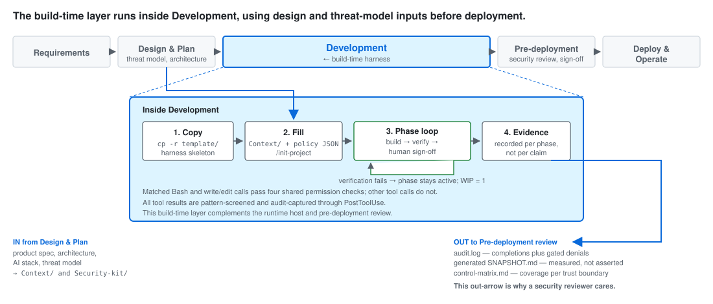
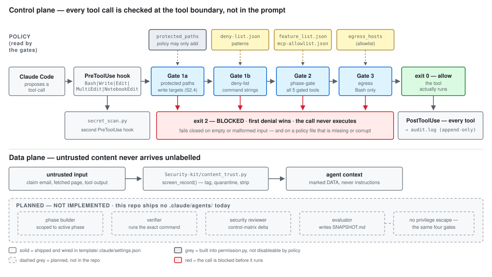
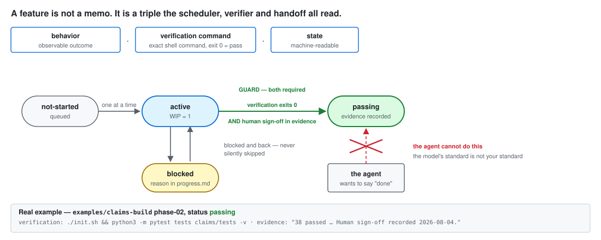

# Harness Engineering Platform

[](LICENSE)


**A harness template whose instruction files guide Claude Code to build more consistent
and more secure AI agents.**

You copy `template/` into a new project, describe your product in `Context/`, and the
harness takes over: the coding agent gets a phase plan it must follow one step at a time,
policy files that decide which tools it may call, and hooks that **mechanically block**
disallowed tool calls at the tool boundary — not by asking the model nicely in a prompt.
It cannot mark its own work done, and it cannot see or route around the gate that
evaluates it. Pure Python standard library, zero runtime dependencies.

> **The mental model:** an *agent* is a model plus tools. The **harness** is everything
> else — the instructions, the policy, the verification, the audit trail. Most agent
> quality and nearly all agent safety live in the harness, not the model.

---

## Where this fits in the SDLC



This is a **build-time** harness. It takes over after Design & Plan has settled the
product and threat model, and it hands evidence forward to pre-deployment review.

It is **not** a runtime guardrail for an already-deployed agent, and it is **not** a
replacement for a pre-deployment security review. It is what makes that review
evidence-based instead of conversational: the reviewer gets an append-only audit log of
every tool call and verdict, a measured evaluation snapshot, and a control matrix mapping
each trust boundary to the mechanism covering it.

---

## How it works



Follow one tool call. The coding agent proposes, say, a `Bash` command. Claude Code's
`PreToolUse` hook fires **before** the command runs and pipes it to
`governance/permission.py`, which applies three gates in a fixed order and stops at the
first denial. If any gate denies, the hook exits **2** and the command never executes —
the agent sees a denial, not a result. If all three pass, the hook exits 0, the tool runs,
and a `PostToolUse` hook appends the call and its verdict to an append-only `audit.log`.

The template wires **5 hooks across 3 events** in `template/.claude/settings.json`: two
`PreToolUse` (the permission gate and a secret scanner), one `PostToolUse` (audit capture,
matching **every** tool — so the log is wider than the gate), and two `Stop` hooks (a final
audit flush and a stale-`progress.md` warning).

### The three gates

| Gate | What it reads | Scope | On denial |
|---|---|---|---|
| **1 — deny-list** | `governance/deny-list.json` | shell **command strings** only | exit 2, unconditional |
| **2 — phase-gate** | `Harness-Best-Practice/feature_list.json` + `governance/mcp-allowlist.json` | all 5 gated tools | exit 2 until the prerequisite phase is signed off |
| **3 — egress** | `egress_hosts` in `governance/mcp-allowlist.json` | **`Bash` commands only** | exit 2 if the target host is not allowlisted |

First denial wins. The gate fails closed on empty or malformed input. Policy lives in
JSON, mechanism lives in `permission.py`, and the two are kept separate so a project
tailors policy without ever touching the enforcement code.

### The feature triple



This is what makes the harness more than a linter. Work is not tracked as prose — every
phase carries a **triple**: an observable *behavior*, an exact *verification command*, and
a machine-readable *state* (`not-started → active → blocked → passing`).

The `active → passing` edge is guarded twice: the verification command must exit 0 **and**
a human sign-off must be recorded in the phase's `evidence` field. **The agent cannot
promote its own phase.** "Mostly done" is not representable.

---

## Security guarantees baked in

- **Tool calls are gated at the boundary, not in the prompt** — `governance/permission.py`,
  invoked by a `PreToolUse` hook. Reasoning-layer rules can be argued around; an exit code
  cannot.
- **Mechanism is separated from policy** — `permission.py` is the engine, the JSON files
  are the policy, and `init.sh` verifies the kit is still wired so it cannot be *silently*
  stripped while the health check still reports PASS. (Note the limit below: the gate does
  not itself write-protect its own files.)
- **Untrusted content is labelled before it reaches context** —
  `Security-kit/content_trust.py` screens fetched pages, emails and tool output so they
  arrive as *data*, never as instructions.
- **Secrets are blocked pre-write** — `Security-kit/secret_scan.py` runs as a second
  `PreToolUse` hook.
- **Every call is auditable** — `Harness-Best-Practice/observability/audit.py` appends
  JSON lines; nothing is rewritten.
- **Claims are measured, not asserted** — `evaluation/eval.py` reports accuracy,
  reproducibility and latency against an oracle, and prints cost as
  `N/A (no real provider wired)` rather than inventing a number.
- **A 41-control reference across 8 domains** — `Security-kit/SECURITY.md`, with an OWASP
  crosswalk and a per-project control matrix.

---

## What it does not enforce

Stated plainly, because a security control you misunderstand is worse than none.

- **Only write/exec tools are gated.** The `PreToolUse` matcher covers
  `Bash|Write|Edit|MultiEdit|NotebookEdit`. `Read`, `Grep`, `Glob`, `WebFetch` and `Task`
  are **not** gated.
- **The deny-list only inspects shell command strings.** `check_deny_list` reads the
  `command` field, which `Write`/`Edit` calls do not have — so deny-list patterns cannot
  protect a *file path*. Nothing in the default gate stops the agent from editing
  `permission.py` or the policy JSON. Protecting those needs a permission rule or file
  ownership outside this gate; `init.sh`'s integrity check detects tampering after the
  fact rather than preventing it.
- **Gate 3 is a command-string check, not network enforcement.** It looks for five tokens
  (`curl `, `wget `, `nc `, `ssh `, `nmap `) in a `Bash` command and allows the call if an
  allowlisted host appears as a substring. A Python one-liner using `urllib`, or a
  `WebFetch`, bypasses it entirely. Read it as "casual egress friction for shell
  commands", not "default-deny egress at the network layer".
- **"Fail-closed" has one deliberate exception.** In steady state — when *every* phase is
  `passing` — the phase gate falls through to the allowlist check rather than denying.
  This is intentional and covered by a test.
- **A malformed deny-list regex degrades to substring matching** rather than failing closed.
- **Automatic enforcement is Claude Code-specific.** Other agent runtimes can invoke
  `permission.py` as a CLI, but they get no automatic hook interception.
- **Zero *runtime* dependencies; `pytest` is needed only for the full test suite.**

---

## Repository layout

| Path | What it is |
|---|---|
| `template/` | The harness itself — copy this. Domain-agnostic, with `{{placeholders}}` to fill. |
| `examples/` | Real filled instances (see below). |
| `assets/` | Diagrams used by this README. |
| `.kiro/specs/harness-engineering-platform/` | The **origin** spec (requirements/design/tasks). Historical — it describes the pre-refactor layout. |
| `LICENSE` | MIT. |

---

## Quick start

```bash
git clone https://github.com/YuanSingapore/harness-engineering-platform.git
cp -r harness-engineering-platform/template my-agent && cd my-agent
./init.sh          # exits non-zero on a fresh copy — by design
```

`init.sh` is a health check, not a scaffolder. On an unfilled copy it fails and prints
exactly what is missing: unfilled placeholders, undefined phases, empty policy. Filling
those in is the whole setup.

**→ Full walkthrough: [`template/README.md`](template/README.md)** — an 8-step guide from
empty copy to a first signed-off phase, plus a per-file directory map, tool-compatibility
notes and troubleshooting. That document is the manual; this page is the front door.

---

## Examples

| Example | Maturity | What it shows |
|---|---|---|
| [`examples/claims-build/`](examples/claims-build/) | **Most complete.** Phases 01–03 signed off, 04 active. | An insurance-claims triage agent built end to end on the current layout: deterministic decision engine, three proofs (`tests/` correct · `demo/` matters · `evaluation/` good), and real signed evidence per phase. **Start here.** |
| [`examples/claims-agent/`](examples/claims-agent/evaluation/TEMPLATE-EVALUATION-REPORT.md) | Evaluation write-up only. | A live A/B build used to *test the template itself* — whether Claude could follow it, and whether the security kit actually changed the built agent. Useful as a critique of the harness. |
| [`examples/red-team-harness/`](examples/red-team-harness/) | Legacy — **pre-refactor layout**. | The original filled example (authorized penetration testing). Structurally dated (flat `governance/`, `observability/`, `tools/`), still useful for seeing policy tailored to a high-risk domain. |

Each example is self-contained: `cd` in and run `./init.sh`.

---

## Roadmap — the sub-agent layer

**There are no sub-agents in this repo today.** `template/.claude/` ships 4 slash commands
(`init-project`, `security-tailor`, `session-cycle`, `domain-workflow`) and no
`agents/` directory. The dashed lane in the architecture diagram is a design sketch, not
shipped code.

The intended direction: decompose the session loop into phase-scoped sub-agents — a
builder confined to the active phase, a verifier that only runs the declared verification
command, a security reviewer that diffs the control matrix, and an evaluator that writes
the snapshot. The hard requirement is that delegation must not become privilege
escalation: a sub-agent would pass the same three gates as its parent.

---

## Documentation

| Question | Read |
|---|---|
| How do I actually use this? | [`template/README.md`](template/README.md) |
| Why is it built this way? | [`template/Harness-Best-Practice/BEST-PRACTICES.md`](template/Harness-Best-Practice/BEST-PRACTICES.md) |
| What security controls exist? | [`template/Security-kit/SECURITY.md`](template/Security-kit/SECURITY.md) · [`owasp-crosswalk.md`](template/Security-kit/owasp-crosswalk.md) |
| How is a claim of "good" measured? | [`template/evaluation/`](template/evaluation/) |
| Where did this come from? | [`.kiro/specs/harness-engineering-platform/`](.kiro/specs/harness-engineering-platform/) — origin spec, not current design |

---

## References & lineage

| Resource | Role |
|---|---|
| [Learn Harness Engineering](https://walkinglabs.github.io/learn-harness-engineering/en/) (13-lecture course) | The "why" — harness theory, lifecycle, the feature-triple and Fresh Session Test this template implements. |
| [Awesome Harness Engineering](https://github.com/Jiaaqiliu/Awesome-Harness-Engineering) | Primary-source map; the agent-vs-harness framing. |
| [Awesome Claude Code](https://github.com/hesreallyhim/awesome-claude-code) | The "how" — CLAUDE.md patterns, hooks, slash commands, subagents. |
| "Harness Engineering: Leveraging Codex in an Agent-First World" (OpenAI) | Credited with coining the term. |
| Anthropic — Building Effective Agents | Design principles for tool-use loops and permission boundaries. |
| [Claude Code on AWS Bedrock — Best Practices](https://github.com/timwukp/claude-code-on-aws-bedrock-best-practices) | Fail-closed hooks and managed-settings hierarchy; our guardrail + audit patterns echo it. |

---

## License

[MIT](LICENSE).
