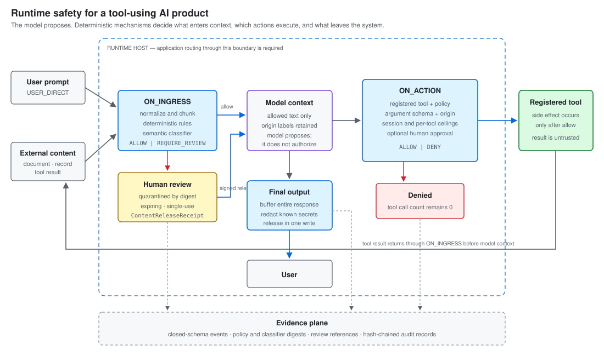

# Harness Engineering Platform

[](LICENSE)


**A runtime safety layer and build-time governance harness for tool-using AI products.**

At runtime, it puts an owned host around the agent loop: user prompts, documents and tool
results pass rule-based and semantic ingress checks; model-proposed actions pass
deterministic policy, origin, schema, session-ceiling and approval checks before a tool can
run; the final output is buffered and screened before release. **The model proposes.
Mechanisms decide** what enters context, which actions execute, and what leaves.

The same repository ships a build-time harness for Claude Code: phase plans, policy files,
verification gates, and hooks that mechanically block disallowed development tool calls.



### What product teams get

| Product concern | Runtime control |
|---|---|
| Prompt injection in user, document or tool-result text | Rules plus semantic classification; anything not affirmatively cleared is withheld for review |
| Unsafe or out-of-scope tool use | A deterministic action gate checks registration, policy, schema, content origin and session ceilings **before** the side effect |
| Sensitive actions | Optional human approval via an expiring, single-use `ActionApprovalReceipt` — which can un-pause a call but never converts a deny |
| False positives | Quarantined content returns only through an exact-digest, expiring, single-use `ContentReleaseReceipt` |
| Secret leakage in the final answer | The whole response is buffered, redacted and released in one write |
| Incident review and release evidence | Closed-schema, hash-chained audit records bind every decision to the policy and classifier digests in force |

The binding promises and their scope are in
[`template/Context/runtime-security-profile.md`](template/Context/runtime-security-profile.md).

### See it run

```bash
cd template
python3 examples/runtime-security-mvp/run.py
```

Synthetic tools, a scripted model, a classifier stub: it demonstrates the control flow and
deterministic enforcement, not production deployment or classifier quality. The
[example README](template/examples/runtime-security-mvp/README.md) says exactly which.

---

## Two enforcement surfaces

| | **Runtime host** | **Build-time harness** |
|---|---|---|
| Protects | the agent deployed to users | the coding agent building the product |
| Boundary | an owned in-process host around context, actions and output | Claude Code hook events around development tool calls |
| Main mechanism | `Security-kit/runtime/host.py` | `governance/permission.py` + `Security-kit/` hook adapters |
| Injection screening | rules **plus** a pinned local semantic classifier | regex rules only |
| Sequence-aware controls | per-tool and total session ceilings | none — every hook is stateless per call |
| Adoption | the application routes every supported source and sink through the host | automatic when the template's Claude Code settings are active |

Both follow one rule: **reasoning proposes, mechanism enforces.** A non-deterministic
component reading attacker-influenceable text cannot be a control surface, because whatever
persuades it disables the control. So enforcement sits *outside* the model on both surfaces.

The runtime claim is deliberately narrow: one owned host, one agent, a fixed registered tool
set, UTF-8 text ingress. Persistent memory, delegation, streaming output, remote classifiers
and binary ingress are disabled; multi-host operation is out of scope. **Nothing forces an
application to use the host** — complete routing is a deployment architecture-review item,
not a property of the library. See the
[profile](template/Context/runtime-security-profile.md) and
[`limitations.md`](template/evaluation/runtime-security/limitations.md).

---

## Build-time development protection


The build-time harness constrains the coding agent while work is in progress, then hands an
audit trail, a generated evaluation snapshot and a control matrix to pre-deployment review.
It complements the runtime host; it does not replace it.

One matched tool call, end to end: the coding agent proposes a `Bash` command. Claude Code's
`PreToolUse` hook fires **before** it runs and pipes it to `governance/permission.py`, which
applies four permission checks in fixed order — protected paths, deny-list, phase gate,
egress — stopping at the first denial. A denial exits **2** and the command never executes.
A pass exits 0, the tool runs, and `PostToolUse` screens the result and appends the verdict
to an append-only `audit.log`. The template wires **7 hooks across 4 events**.

The same four checks are reused by the runtime host for every registered tool — the
difference is scope: build-time hooks match only `Bash|Write|Edit|MultiEdit|NotebookEdit`;
the host gates every tool in the registry it wraps. A raw callable invoked *outside* the
host reaches none of them.

**→ The full mechanism — each check, what it reads, why it fails closed, and the feature
triple that stops an agent promoting its own phase — is in
[`template/README.md` § How enforcement works](template/README.md#how-enforcement-works).**


---

## Integrating the runtime host

The deployed application owns one `RuntimeHost` and routes each supported source and sink
through it:

1. `submit_prompt(...)` — screens user text before it enters model context.
2. `invoke_tool(...)` — applies session, origin, schema, policy and approval controls before
   a registered tool runs. A denial leaves the tool's call count at zero.
3. `deliver_tool_result(...)` — treats every tool result as untrusted external content.
4. `finish(...)` — buffers and screens the complete final response before release.

Quarantined content re-enters context only via `release_quarantined(...)` with a valid
receipt. Structured records use the explicit ingress adapter described in the profile.

Start with the [walkthrough](template/examples/runtime-security-mvp/README.md); use the
[profile](template/Context/runtime-security-profile.md) as the deployment contract.

---

## What it does not enforce

Stated plainly, because a security control you misunderstand is worse than none. Each line
links to the full statement.

- **Runtime routing is opt-in.** Anything that bypasses the host bypasses its controls.
  Verified by architecture review, not by the library —
  [`SEC-RUNTIME-GAP-001`](template/Security-kit/control-matrix.md).
- **Semantic classification is not proof of benign intent.** On the committed benchmark,
  rules plus the classifier caught **14 of 16** attacks and withheld **3 of 8** legitimate
  cases; two workflow-impersonation attacks were confidently misclassified. The action and
  output gates are the compensating layers —
  [`classifier-selection.md`](template/evaluation/runtime-security/classifier-selection.md).
- **The review queue is unbounded in code.** Fail-closed screening queues false positives
  for a human; the deployment sets the bound — [`limitations.md`](template/evaluation/runtime-security/limitations.md).
- **Text-only, single-agent.** Memory, delegation, binary ingress, remote classifiers and
  streaming refuse to start. Multi-host is out of scope.
- **Not an OS sandbox or a network firewall.** It governs sources and sinks routed through
  the host; it does not confine a compromised process.
- **Build-time gates cover write/exec tools only.** `Read`, `Grep`, `WebFetch` and `Task`
  are unmatched — a `Task` spawn reaches no gate. The runtime host has no such hole.
- **Egress is policy matching, not network enforcement.** Hosts match exactly and structured
  destinations are checked on every tool, but the shell half is a five-token blocklist and
  field matching is by *name* — [`template/README.md` § Gate 3](template/README.md#how-enforcement-works).
- **The agent cannot edit its own gate — except through a scripting runtime.** 28 files are
  hard-denied by identity; `python3 -c` opening one for write is a measured, pinned residual
  — [`SECURITY.md` S2.4](template/Security-kit/SECURITY.md).
- **Core is standard library; the semantic classifier is not.** It runs as a separate,
  digest-pinned local process with its own venv
  ([`requirements.lock.txt`](template/evaluation/runtime-security/requirements.lock.txt)).
  `pytest` is needed only for the full suite.

---

## Repository layout

| Path | What it is |
|---|---|
| `template/` | The harness itself — copy this. Domain-agnostic, with `{{placeholders}}` to fill. |
| `template/Security-kit/runtime/` | The runtime host and its 15 enforcement modules. |
| `template/evaluation/runtime-security/` | Measured evidence: attack traces, replay results, classifier selection, limitations, the signed verdict. |
| `examples/` | Real filled instances (below). |
| `assets/` | Diagrams used by this README. |
| `.kiro/specs/harness-engineering-platform/` | The **origin** spec — historical, pre-refactor layout. |
| `LICENSE` | MIT. |

---

## Quick start

```bash
git clone https://github.com/YuanSingapore/harness-engineering-platform.git
cp -r harness-engineering-platform/template my-agent && cd my-agent
./init.sh          # exits non-zero on a fresh copy — by design
```

`init.sh` is a health check, not a scaffolder. On an unfilled copy it reports
`FAIL — 5 error(s)`: **four** unfilled `{{placeholders}}` (identity, phases, policy) and
**one** fail-closed coverage gate that only `/security-tailor` clears, because *which of the
20 OWASP LLM/Agentic risks apply* is a property of your product, not the template. Fill the
placeholders → run `/security-tailor` → re-run `./init.sh` until it exits 0.

**→ Full walkthrough: [`template/README.md`](template/README.md)** — the 10-step guide, where
your own code goes (the template ships no `src/`, on purpose), the directory map, tool
compatibility and troubleshooting. That document is the manual; this page is the front door.

---

## Examples

| Example | Maturity | What it shows |
|---|---|---|
| [`template/examples/runtime-security-mvp/`](template/examples/runtime-security-mvp/) | Runtime control flow | One owned-host run: clean prompt in, poisoned tool result withheld before model reuse, side-effect sink untouched, output buffered, evidence hash-chained. Synthetic throughout — not a production-readiness proof. |
| [`examples/claims-build/`](examples/claims-build/) | **Most complete build.** Phases 01–03 signed off, 04 active; `./init.sh` exits 0; 50 tests pass. | An insurance-claims triage agent built end to end *inside* the harness. Built on an **earlier template generation** — no coverage gate, 4 harness suites not 36, no runtime host — and [its README says which parts](examples/claims-build/README.md#what-this-example-predates). |
| [`examples/claims-agent/`](examples/claims-agent/evaluation/TEMPLATE-EVALUATION-REPORT.md) | Evaluation write-up | A live A/B build used to test the template itself. Read it as a critique of the harness. |
| [`examples/red-team-harness/`](examples/red-team-harness/) | Legacy, pre-refactor layout | The original filled example (authorized penetration testing); policy tailored to a high-risk domain. |

---

## Roadmap

### Runtime — implemented; deployment assurance remains

Rule-plus-semantic ingress, quarantine and receipted release, guarded dispatch with origin
and schema rules, per-tool and total session ceilings, action-approval receipts, startup
validation, buffered output, hash-chained evidence and a side-effect replay matrix are all
shipped and measured. The release verdict is
[`DEPLOY_WITH_RULES`](template/evaluation/runtime-security/VERDICT.md) — five conditions,
fixed expiry, signed. What remains strengthens assurance without widening the profile:

| Next | Why it remains |
|---|---|
| Independent security review | Verification so far was run by the authors; a written release condition |
| Prove complete application routing | The library cannot force every source and sink through its host |
| Bound and operate the review queue | Fail-closed ingress can exhaust reviewer attention |
| Detection by provenance | Both measured misses are invisible to a text-only classifier; carrying origin to the detector is designed, not built |
| Resident classifier process | ~0.7 s per item today, almost all model load; same contract, tens of ms |
| Memory, delegation, binary ingress, streaming | Each is a new source or sink and needs its own threat model before it is enabled |
| `/runtime-harden` | The drafter that would generate per-project wiring; today it is done by hand from `SECURITY.md` S1.6 |

### The sub-agent layer

**There are no sub-agents in this repo today** — `template/.claude/` ships 4 slash commands
and no `agents/` directory. The intended direction is phase-scoped sub-agents (builder,
verifier, security reviewer, evaluator) that each pass the same gates as their parent, so
delegation cannot become privilege escalation. Design only.

---

## Documentation

| Question | Read |
|---|---|
| How do I actually use this? | [`template/README.md`](template/README.md) |
| What exactly does the runtime host promise? | [`runtime-security-profile.md`](template/Context/runtime-security-profile.md) |
| What was measured, and what remains open? | [`evaluation/runtime-security/`](template/evaluation/runtime-security/) · [`limitations.md`](template/evaluation/runtime-security/limitations.md) |
| What release decision was recorded? | [`VERDICT.md`](template/evaluation/runtime-security/VERDICT.md) — scoped to revision, policy, lock, conditions and expiry |
| What security controls exist, and how are they mapped to OWASP? | [`Security-kit/README.md`](template/Security-kit/README.md) · [`SECURITY.md`](template/Security-kit/SECURITY.md) · [`owasp-crosswalk.md`](template/Security-kit/owasp-crosswalk.md) |
| Why is it built this way? | [`BEST-PRACTICES.md`](template/Harness-Best-Practice/BEST-PRACTICES.md) |
| Where did this come from? | [`.kiro/specs/harness-engineering-platform/`](.kiro/specs/harness-engineering-platform/) — origin spec, not current design |

---

## References & lineage

| Resource | Role |
|---|---|
| [Learn Harness Engineering](https://walkinglabs.github.io/learn-harness-engineering/en/) | The "why" — harness theory, the feature triple and Fresh Session Test this template implements. |
| [Awesome Harness Engineering](https://github.com/Jiaaqiliu/Awesome-Harness-Engineering) | Primary-source map; the agent-vs-harness framing. |
| [Awesome Claude Code](https://github.com/hesreallyhim/awesome-claude-code) | CLAUDE.md patterns, hooks, slash commands, subagents. |
| "Harness Engineering: Leveraging Codex in an Agent-First World" (OpenAI) | Credited with coining the term. |
| Anthropic — Building Effective Agents | Design principles for tool-use loops and permission boundaries. |
| [Claude Code on AWS Bedrock — Best Practices](https://github.com/timwukp/claude-code-on-aws-bedrock-best-practices) | Fail-closed hooks and managed-settings hierarchy. |

---

## License

[MIT](LICENSE).
